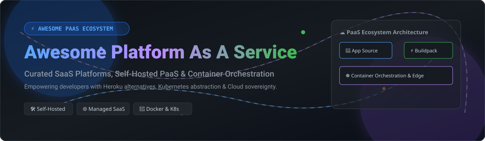

# ⚡ Awesome Platform As A Service (PaaS) 🚀

  

  
  
  
  
  

## 🌟 Top Platform as a Service (PaaS) Ecosystem 🌐

**Curated List of SaaS Products & Open-Source GitHub Self-Hosted Platforms**  
*Focused on Application Deployment, Self-Hosted PaaS, Developer Experience (DX) & Container Orchestration*  

📅 **Last updated: October 2026**

---

### 🔎 Overview & SEO Highlights
Welcome to the definitive guide on **Platform as a Service (PaaS)**, **Self-Hosted Heroku Alternatives**, **Vercel Alternatives**, and **Cloud Application Deployment Engines**. This repository tracks notable commercial PaaS platforms, self-hosted open-source software, and container management frameworks that abstract away cloud infrastructure so software engineers can focus on shipping code.

Whether you are looking for **git-push deployments**, **automated SSL certificates**, **managed cloud databases**, or **Kubernetes control panels**, this list has curated solutions for startups, indie hackers, and enterprise DevOps teams.

---

## 📑 Table of Contents
- [☁️ SaaS / Hosted Platforms](#-saas--hosted-platforms)
- [🛠️ Open-Source GitHub Projects](#️-open-source-github-projects)
- [🤝 How to Contribute](#-how-to-contribute)
- [⚠️ Disclaimer](#️-disclaimer)
- [💖 Support & Sponsorship](#-support--sponsorship)
- [📈 Star History](#-star-history)

---

## ☁️ SaaS / Hosted Platforms

> [!NOTE]
> 📊 **Market Overview**: The Platform as a Service (PaaS) sector is estimated at **$130+ Billion (2026)** and is **moderately fragmented** — dominated at the top by hyper-scaler enterprise platforms (Microsoft, AWS, Google), while a vibrant ecosystem of specialized and developer-centric PaaS providers (Vercel, Render, Railway, Fly.io) competes on developer experience and speed.

| Platform | Parent / Company | Valuation / Market Cap / Revenue | Starting Paid Price | Free Tier / Free Trial Limits |
| :--- | :--- | :--- | :--- | :--- |
| **[Azure App Service](https://azure.microsoft.com/en-us/products/app-service/)** | Microsoft (NASDAQ: MSFT) | ~$3.1 Trillion Market Cap | $13.00/month (Basic B1 Linux instance) | Free F1 Plan: 60 CPU min/day, 1 GB RAM, 1 GB storage (shared compute, no custom domain) |
| **[AWS Elastic Beanstalk](https://aws.amazon.com/elasticbeanstalk/)** | Amazon (NASDAQ: AMZN) | ~$2.2 Trillion Market Cap | ~$12.00/month (Underlying t3.micro EC2 + storage) | Free Tier (12 Months): 750 hrs/month t3.micro EC2 & 750 hrs/month RDS |
| **[Google App Engine](https://cloud.google.com/appengine)** | Alphabet (NASDAQ: GOOGL) | ~$2.0 Trillion Market Cap | ~$10.00/month (Standard instance F1 billing) | Free Tier: 28 instance-hours/day (F1 instance), 1 GB egress/day, 5 GB Cloud Storage |
| **[Heroku](https://www.heroku.com/)** | Salesforce (NYSE: CRM) | ~$300 Billion Market Cap | $5.00/month (Eco dyno plan, 1,000 dyno hours/month) | No permanent free plan; $5/mo minimum Eco plan required |
| **[DigitalOcean App Platform](https://www.digitalocean.com/products/app-platform)** | DigitalOcean (NYSE: DOCN) | ~$16.5 Billion Market Cap | $5.00/month (Basic tier container) | Free Tier: 3 static sites per account, 1 GiB bandwidth/app |
| **[Vercel](https://vercel.com/)** | Vercel Inc. | $9.3 Billion Valuation | $20.00/user/month (Pro plan) | Free Hobby Plan: 100 GB bandwidth, 1M edge requests, 1M function invocations/month |
| **[Render](https://render.com/)** | Render Labs Inc. | $1.5 Billion Valuation | $7.00/month (Starter service compute) | Free Hobby Plan: 750 instance-hours/month (spins down after 15 min inactivity, DB expires 30 days) |
| **[Platform.sh (Upsun)](https://platform.sh/)** | Platform.sh SAS | $560 Million Valuation | €9.00/month project base fee + resource usage | 30-day free trial (no permanent free hosting tier) |
| **[Fly.io](https://fly.io/)** | Fly.io Inc. | ~$300+ Million Valuation | ~$2.00–$5.00/month (Pay-as-you-go per second) | 7-day or 2 VM-hours free trial (no permanent free hosting tier) |
| **[Railway](https://railway.app/)** | Railway Corp | $100 Million Funding | $5.00/month (Hobby plan base floor) | 30-day free trial with $5 one-time credit; then $1/month recurring free credit |

---

## 🛠️ Open-Source GitHub Projects

Below is a list of open-source self-hosted PaaS solutions, container engines, and deployment frameworks, **sorted by GitHub Stars_Count (descending)**:

1. **[Coolify](https://github.com/coollabsio/coolify)**   
   🚀 **The leading open-source self-hosted PaaS** — Apache-2.0 licensed. Self-hostable alternative to Vercel, Heroku, Netlify, and Railway. Deploy applications, databases (PostgreSQL, MySQL, MongoDB, Redis), and 300+ services onto any VPS via SSH with Git-based automated deployments and automatic Let's Encrypt SSL.

2. **[Dokploy](https://github.com/Dokploy/dokploy)**   
   🎨 **Modern open-source PaaS with polished UI** — Apache-2.0 licensed. A next-gen Vercel/Heroku alternative supporting Node.js, Python, PHP, Go, Rust, and Dockerfiles with automatic previews, Traefik routing, and multi-node setup.

3. **[Dokku](https://github.com/dokku/dokku)**   
   ⚡ **The smallest PaaS implementation** — MIT licensed. Docker-powered Heroku alternative in ~100 lines of bash. Simple `git push dokku main` workflow with support for CNCF buildpacks and Dockerfiles on minimal VPS resources.

4. **[Rancher](https://github.com/rancher/rancher)**   
   ☸️ **Enterprise Kubernetes Management Platform** — Apache-2.0 licensed. Multi-cluster management tool that simplifies enterprise container management across multi-cloud and on-premise infrastructure.

5. **[CapRover](https://github.com/caprover/caprover)**   
   🖥️ **User-friendly Web GUI PaaS** — Apache-2.0 licensed. Docker Swarm-backed platform with 1-click deployments for WordPress, MySQL, Nginx, and 100+ applications without command-line overhead.

6. **[Kamal](https://github.com/basecamp/kamal)**   
   📦 **Zero-orchestration Docker deployment tool** — MIT licensed (formerly MRSK by 37signals). Deploys web apps from bare metal to cloud VMs using Docker over SSH with zero-downtime rolling updates.

7. **[OpenShift](https://github.com/openshift/origin)**   
   🏢 **Enterprise Kubernetes PaaS distribution** — Red Hat's open-source origin platform with developer-first Source-to-Image (S2I) pipelines and enterprise security governance.

8. **[Flynn](https://github.com/flynn/flynn)**  *(Archived)*  
   🏛️ **Classic open-source PaaS** — Docker-based Heroku-like platform providing historical reference for modular PaaS control planes.

9. **[Rainbond](https://github.com/goodrain/rainbond)**   
   ☁️ **Cloud-native application delivery platform** — Cloud-native computing platform focusing on non-intrusive microservices and zero-K8s learning curve.

10. **[Devtron](https://github.com/devtron-labs/devtron)**   
    🔒 **K8s software delivery dashboard** — Integrated no-code CI/CD pipeline, GitOps engine, and security scanner tailored for Kubernetes clusters.

11. **[Piku](https://github.com/piku/piku)**   
    🐍 **Ultra-lightweight git-push PaaS** — Inspired by Dokku, written in ~200 lines of Python. Ideal for ARM devices, Raspberry Pis, and minimal VPS servers.

12. **[Tsuru](https://github.com/tsuru/tsuru)**   
    🏢 **Extensible multi-tenant PaaS** — Apache-2.0 licensed container platform supporting Python, Go, Node.js, and Ruby for enterprise deployments.

13. **[Kubero](https://github.com/kubero-dev/kubero)**   
    ⚓ **Kubernetes-native developer PaaS** — Developer dashboard bringing Heroku DX and GitOps workflows directly to Kubernetes.

14. **[KubeVela](https://github.com/kubevela/kubevela)**   
    🧩 **Application delivery engine for Kubernetes** — Open Application Model (OAM) abstraction layer simplifying multi-cloud application delivery.

---

## 🤝 How to Contribute
Contributions are warmly welcomed! Please follow these simple guidelines:

1. 🍴 **Fork** this repository.
2. 📝 **Add or update** entries in `README.md` following the standard table or list format.
3. 🔎 Ensure descriptions are factual, objective, and include proper links.
4. 🔀 Submit a **Pull Request (PR)** with a clear summary of changes.

---

## ⚠️ Disclaimer
- This list is **community-curated** for educational and decision-making purposes.
- Self-hosted PaaS solutions require server management, security patching, backup configurations, and infrastructure maintenance.
- Verify project maintenance activity prior to making production commitments.

---

## 💖 Support & Sponsorship

If you find this repository helpful for your cloud infrastructure choices or developer workflow, please consider supporting the project!

- 🌟 **Star this repository** on GitHub to increase visibility.
- 🔀 **Fork & Share** it with developers, DevOps engineers, and cloud architects.
- ☕ **Buy me a coffee / Sponsor**: Support ongoing maintenance on the [GitHub Sponsor Dashboard](https://github.com/sponsors/ishandutta2007).

Thank you for being part of the open-source community! ❤️

---

## 📈 Star History

---

  <b>Made with ❤️ for developers, platform engineers, and cloud architects worldwide.</b>

